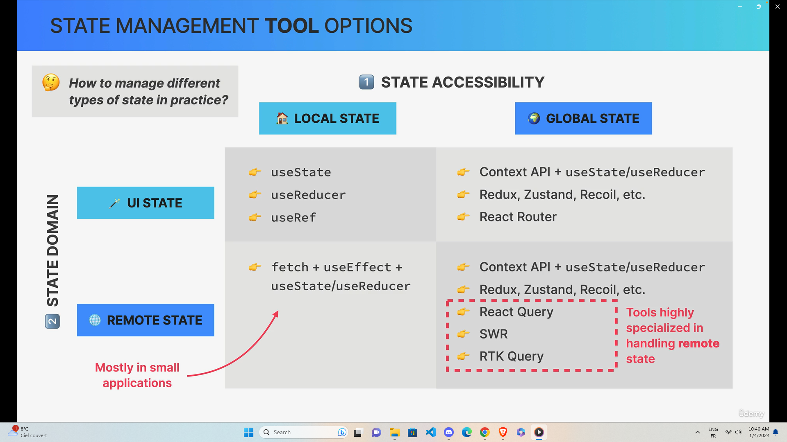
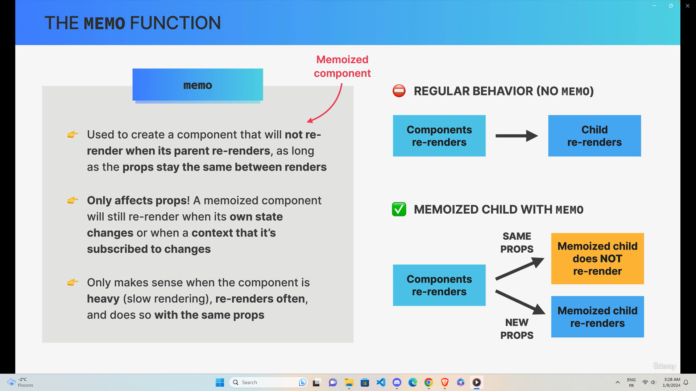
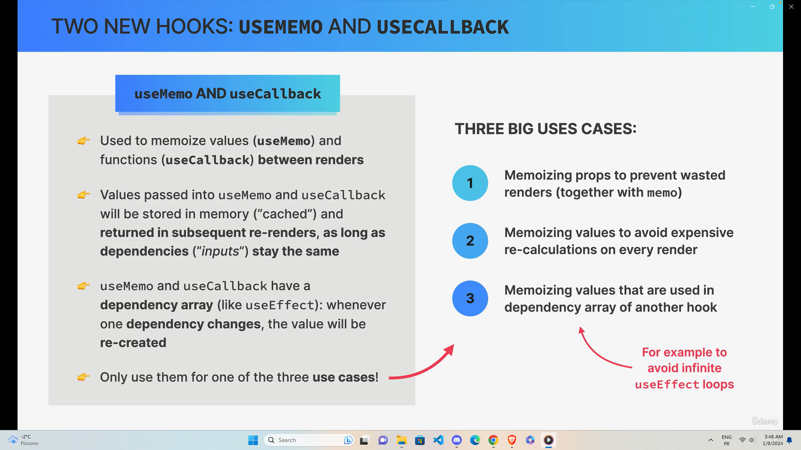

# WHat is the Context API ?

- System to pass data throughout the app without manually passing props down the tree
- Allows us to "brodcast" global state to the entire app

1. <strong>Provider:</strong> gives all child components access to value
2. <strong>value:</strong> data that we want to make available (usually state and functions)
3. <strong>Consumers:</strong> all components that read the provided context value

- whenever there is an update in a context value all consumer component are re-render

# When to use memo, useMemo and useCallback

