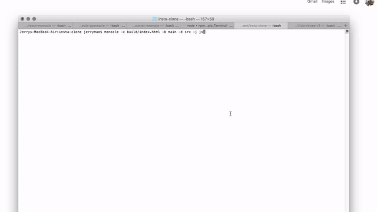

# Components

- React applications are entirely made out of components
- Components are Building blocks of user interfaces in React
- each pieces of UI has it's own data, logic and apperance
- complex UIs are build by building multiple components and combining them
- Components can be reused, nested inside each other, and pass data between them

## Component Trees

 

 

- React use a ONE-WAY data flow, data can only be passe from parent to children component
  - It makes applications more predictable and easier to understand
  - It makes applications easier to debug, as we have more control over the data
  - is more performant

## Separation of concerns

- JavaScript is in charge of HTML

  - Logic and UI are tightly coupled

- Why keep them separeted ?
  - React component + JSX

Even they are all use on the same location ( React ) Each Component is concerned with one piece of the UI

## Props

- Props are read-only, they are immutable ( if you need to mutate props you actually need state )
  - Props are used to pass data from parent composents to child components (down the component tree )
  - they are essential tool to configure and customize components (like function parameters)
  - With props, parent components control fow child components look and work
  - anything can be passed as props: single values, arrays, objects, functions, even other components

## General JSX Rules

- JSX works essentialy like HTML, but we can enter "JavaScript mode" by using {}
- We can place JavaScript expressions inside {}. e.g : [].map(), ternary operator
- Statement are not allowed (if/else, for, switch)
- JSX produces a JavaScript expression
- A piece of JSX can only have one root element

### React Fragment

<> </> React fragment let us groups some elements without leaving any trace in the DOM contrary to a div

### Challenge Profile Card

- https://codesandbox.io/p/sandbox/laughing-rubin-wym4ld?file=%2Fsrc%2FApp.js%3A44%2C11
