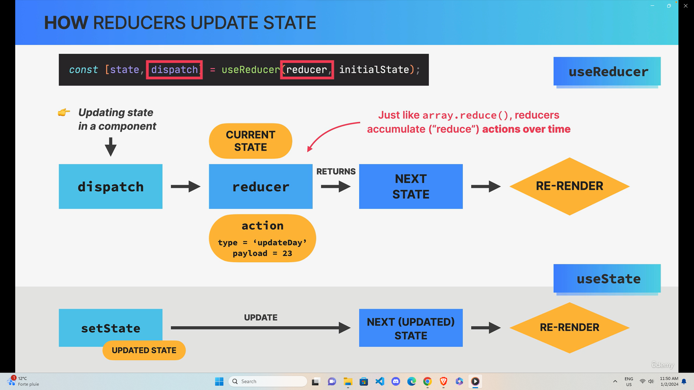

# Managing state with useReducer

- An alternative way of setting state, ideal for complex state and related pieces of state
- Stores related pieces od state in a state object
- useReducer needs reducer: function containing all logic to update state. Decouples state logic from component
- reducer: pure function (no side effects!) that takes current state and action, and returns the next state
  - action: object that describes how to update state
  - dispatch: function to trigger state updates, by "sendings" actions from event handlers to the reducer

# Challenge Creating a Bank account with useReducer

- https://codesandbox.io/p/sandbox/vigorous-wood-29vtfl?file=/src/App.js
