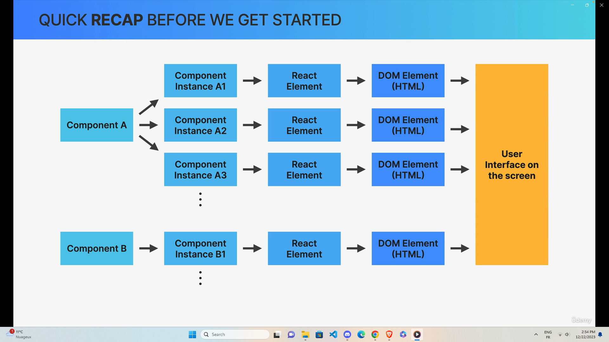
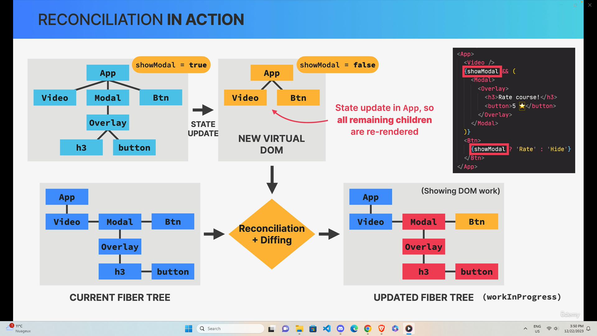
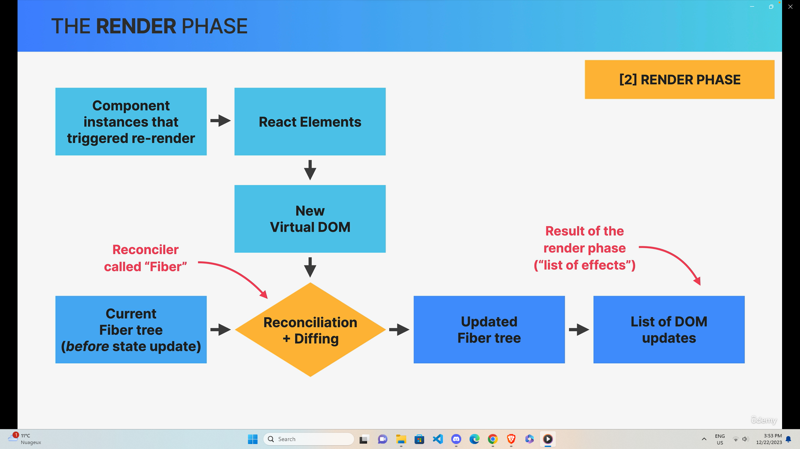
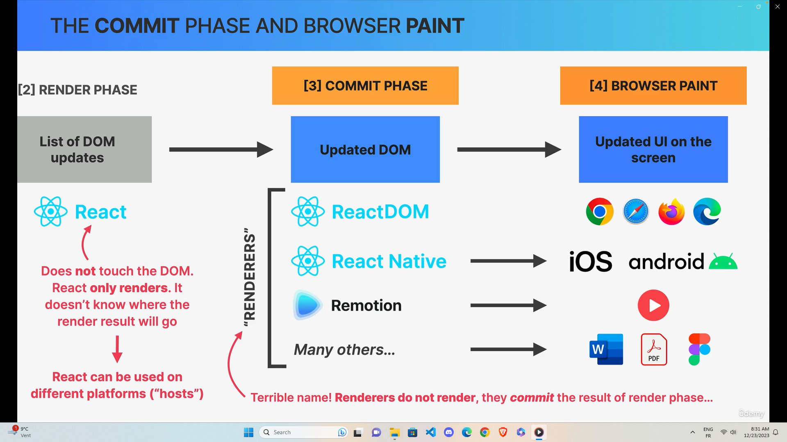
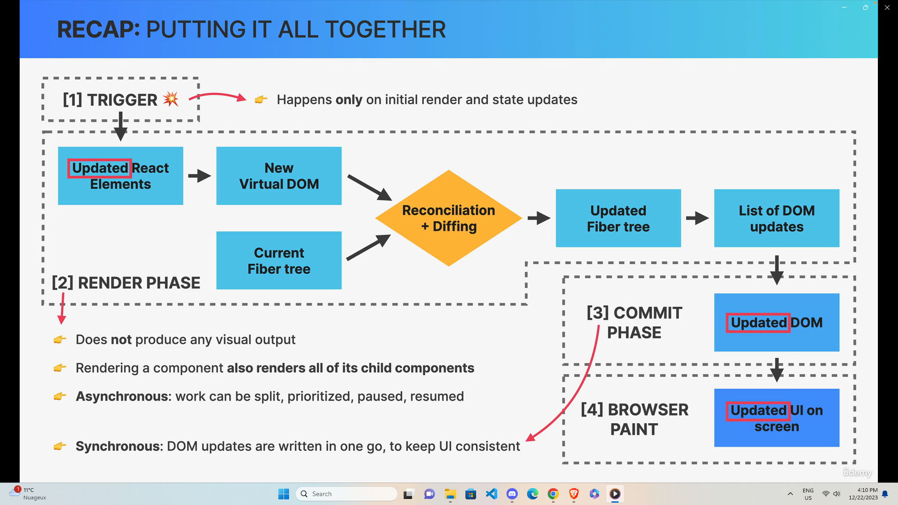
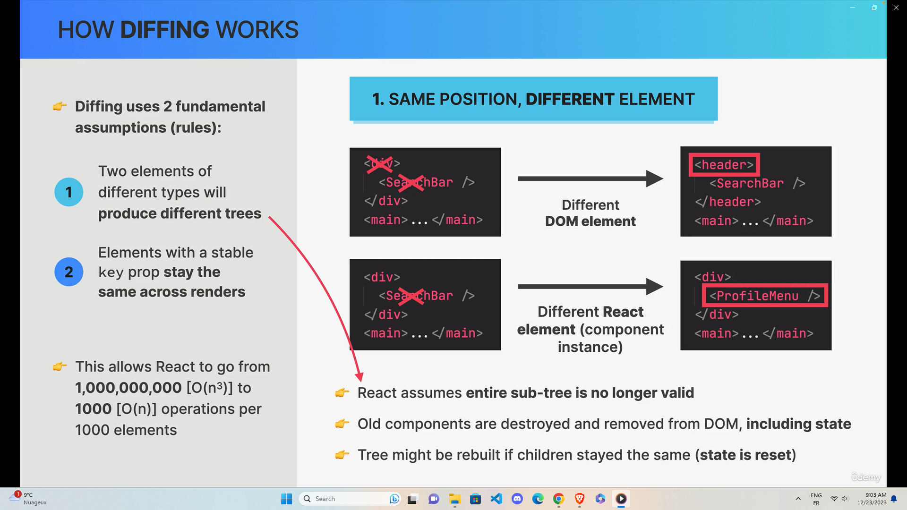
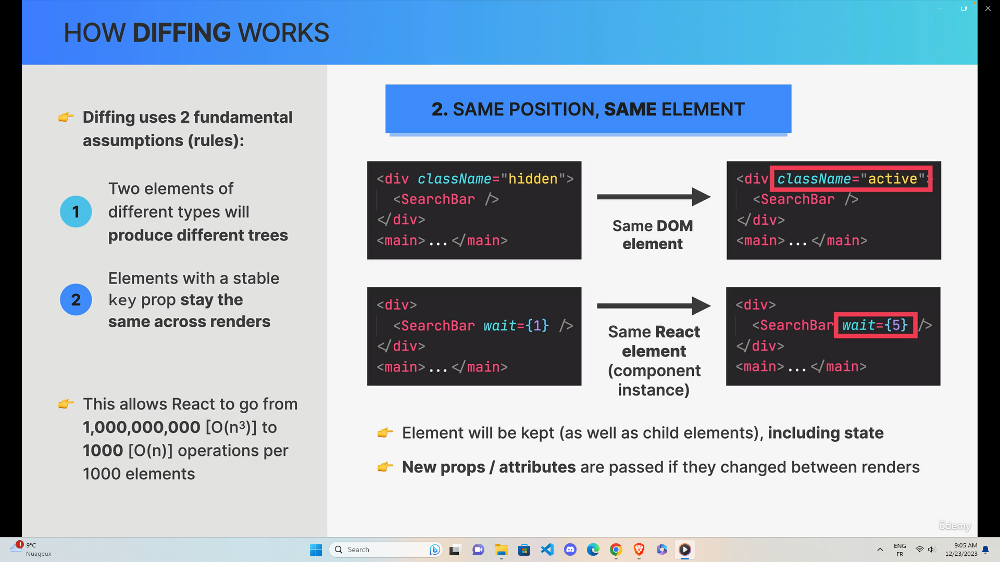

# HOW REACT WORKS

## COMPONENT | INSTANCE | ELEMENT

- Description of a piece of UI
- A component is a function that returns React elements (element tree), usually written as JSX
- also called "Blueprint" or "Template"
- has it's own state and props and lifecycle ("born", "live" and "die")

## Component need to rerender

### reconcialiation

  

### render phase

  

### commit phase

  

### recap

  

## Diffing

#### Elements of different types will produce different trees

#### Elements with a stable key prop stay the same across renders

## KEY Prop

- Special prop that we use to tell the diffing algorithm that an element is unique
- Allows React to distinguish betwween multiple instances of the same component type
  - When a key stays the same across renders, the element will be kept in the dom
  - When a key changes between renders, the element will be destroyed and a new one will be created
