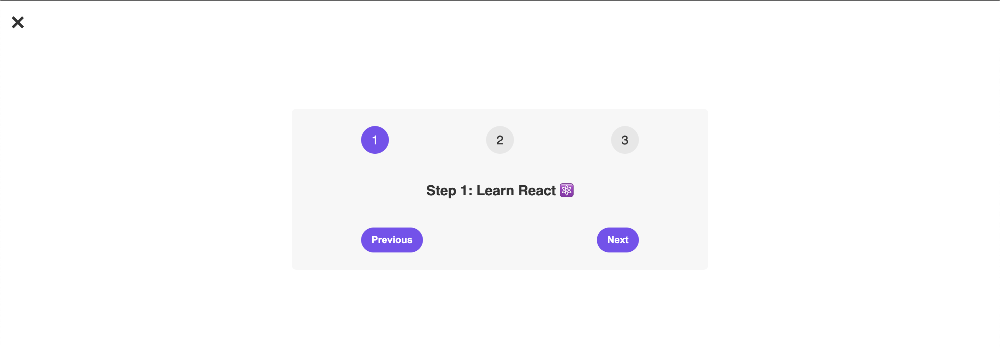
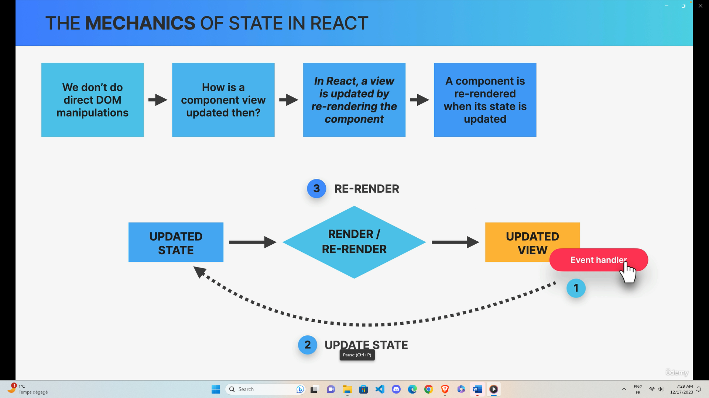
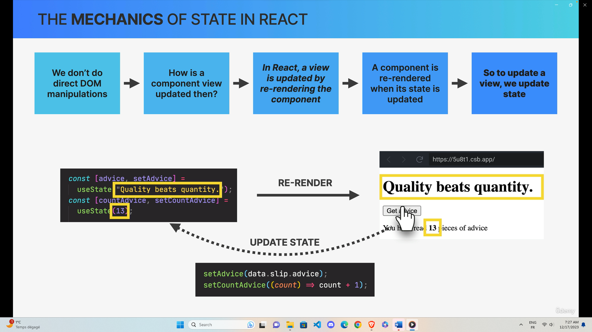

## State

- Data that a component can hold over time, necessary for information that it needs to remember throughout the app's lifecycle
- "Component's memory"
- "State variable" / "piece of state": A single variable in a Component (component state)
- Updating component state triggers React to re-render the component
- State allows developers to :

  1. Update the component's view (by re-rendering it)
  2. Persist local variables between renders

## Mechanics of state

e.g:

## Guidelines about state

- Use a state variable for any data that the component should keep track of ("remember") over time. This is data that will change at some point.
- NEVER UPDATE STATE BASED ON CURRENT STATE !!!
  - if you want to change the way a component looks, or the data it displays, update its state. This usually happens in an event handler function.
- Whenever you want something in the component to be dynamic, create a piece of state related to that "thing", and update the state when the "thing" should change.
- for data that should not trigger component re-renders, don't use state. Use a regular variable instead.

## The Children Prop

- The children prop allow us to pass JSX into an element (besides regular props)
- Essential tool to make reusable and cufigurable components (especially component content)
- Really useful for generic components that don't know their content before being used (e.g modal)

### Challenge Date Counter

- https://codesandbox.io/p/sandbox/flamboyant-mclean-d4ldhr?file=%2Fsrc%2FApp.js%3A30%2C46
