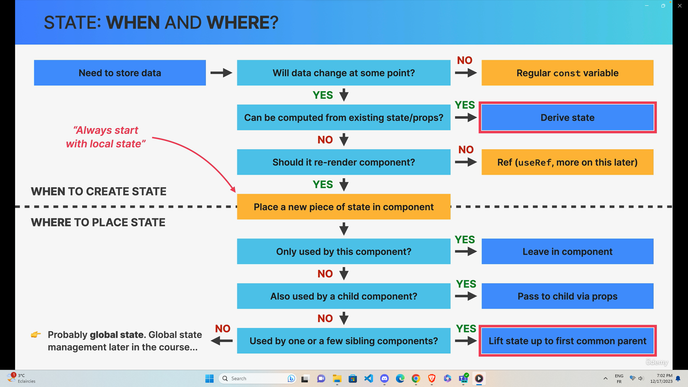

# Thinking in React

1. Break the desired UI into components and establish the component tree
2. Build a static version in React (without state)
3. Think about state:

- When to use state
- Types of state: local / global
- Where to place each piece of state

4. Establish data flow:

- One-way data flow
- Child-to-parent communication
- Accessing global state

## State vs Props

## Local / Global State

## When and Where

## Derived state

## Exercise 1 Flashcards

- https://codesandbox.io/p/sandbox/friendly-lalande-r9vlyg?file=%2Fsrc%2FApp.js%3A52%2C1

## Challenge Date Counter

- https://codesandbox.io/p/sandbox/flamboyant-mclean-d4ldhr

## Excercise 1 Accordion

- https://codesandbox.io/p/sandbox/dreamy-james-ksp8rj?file=%2Fsrc%2FAccordion.js

## Challenge Tip Calculator

- https://codesandbox.io/p/sandbox/adoring-frost-k9vyp8?file=%2Fsrc%2Fcomponent%2FBill.js%3A6%2C41
