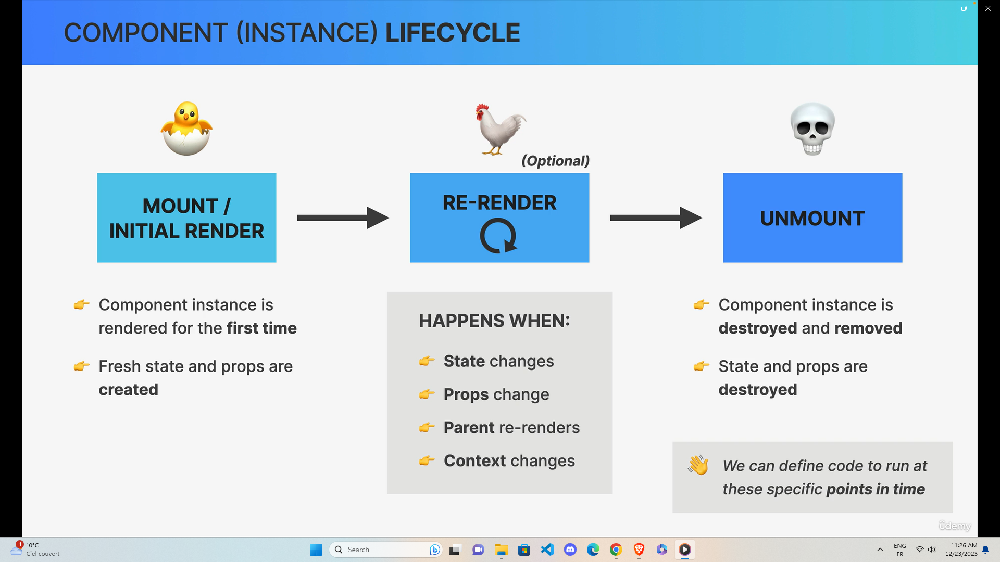
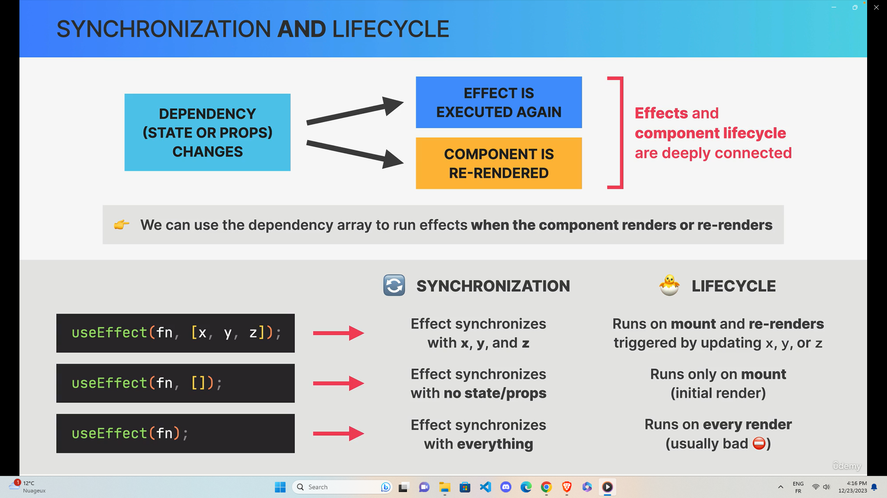

## When to create a New Component ?

(Suggestion: When in doubt, start with a relatively big component, then split it into smaller components as it becomes necessary)

1. Logical separation of content/layout

- Does the component contain pieces of content or layout that don't belong together ?
- is It possible to reuse part of the component?
- Do you want or need to reuse it ?
- Is the component (doing too many different things, rely on too many props, have too many pieces of state, code complex or confusing) ?
- do you prefer smaller functions/components?

2. Reusability
3. Responsibilities / complexity
4. Personal coding style

## Challenge Text Expander Component

- https://codesandbox.io/p/sandbox/quizzical-field-cwnl3k

## Where to create SIDE EFFECTS

Side effect is basically any "interaction between a React component and the world outside the component". We can also think of a side effect as "code that actually does something".
e.g Data fetching, setting up subscriptions, setting up timers, manually accessing the DOM etc...

- SIDE EFFECT can be made in:
  1. Event handlers (onClick, onSubmit, etc...)
  2. Effects (useEffect)
  - Effects allow us to write code that will run at different moments: mount, re-render or unmount

### UseEffect Cleanup func

- Function that we can return from an effect (optional)
- Runs on two different occasions:
  - Before the effect is executed again
  - After a component has unmounted
- Necessary whenever the side effect keeps happening after the component has been re-rendered or unmounted
- Each effect should do only one thing! Use one useEffect hook for each side effect. This makes effects easier to clean up

## Challenge Currency Converter

- https://codesandbox.io/p/sandbox/nameless-night-hhnp74

## Challenge useGeolocate

- https://codesandbox.io/p/sandbox/sleepy-jepsen-y5ktpz
